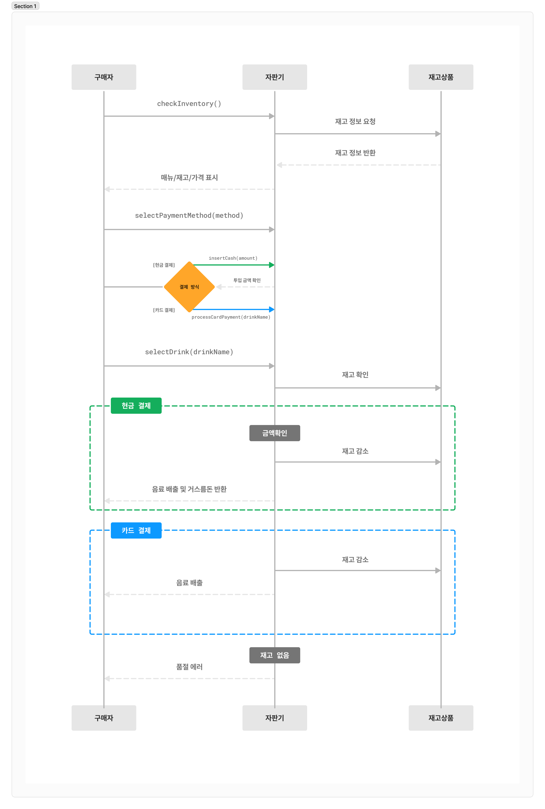

# 자판기 동작원리 코드 과제
자판기 로직과 제품 판매 프로세스를 타입스크립트 코드로 표현합니다.\
Represent the vending machine logic and product serve process in Typescript code.



## 소개 (Introduction)
TypeScript를 사용하여 자판기의 로직을 표현하는 커맨드 툴을 만들었습니다.\
단계별로 필요한 포인트를 접근하여 자판기가 물품을 판매하는 과정까지 구현해 보았습니다.

## 필수 조건 (Prerequisites)
- Node.js (최신 LTS 버전 권장)
- npm (Node.js와 함께 설치됨)

## 설치 (Installation)
- 프로젝트 의존성을 설치하기 위해 다음 명령어를 실행하세요:
- vscode Go Live를 활용하여 구동이 가능합니다.

```bash
npm install
```

이 명령어는 다음 개발 의존성을 설치합니다:
- http-server (^14.1.1)
- typescript (^5.7.2)

## 사용 가능한 스크립트 (Available Scripts)

### 개발 서버 시작
```bash
npm start
```
- HTTP 서버를 시작하고 public/index.html 파일을 자동으로 엽니다.

### TypeScript 컴파일
```bash
npm run build
```
- TypeScript 파일을 JavaScript로 컴파일합니다.

### 실시간 컴파일
```bash
npm run watch
```
- TypeScript 파일의 변경 사항을 감지하여 자동으로 재컴파일합니다.

## 프로젝트 구조 (Project Structure)
```
프로젝트_루트/
├── docs/
│   └── sequence-diagram.png
├── public/
│   └── index.html
├── src/
│   └── [TypeScript 소스 파일]
├── package.json
└── tsconfig.json
```
